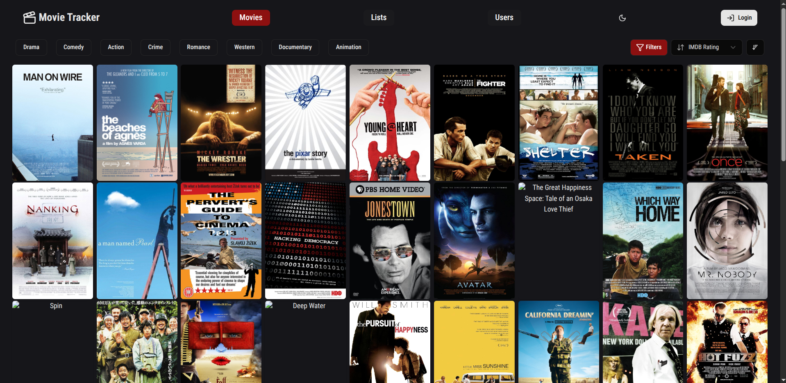
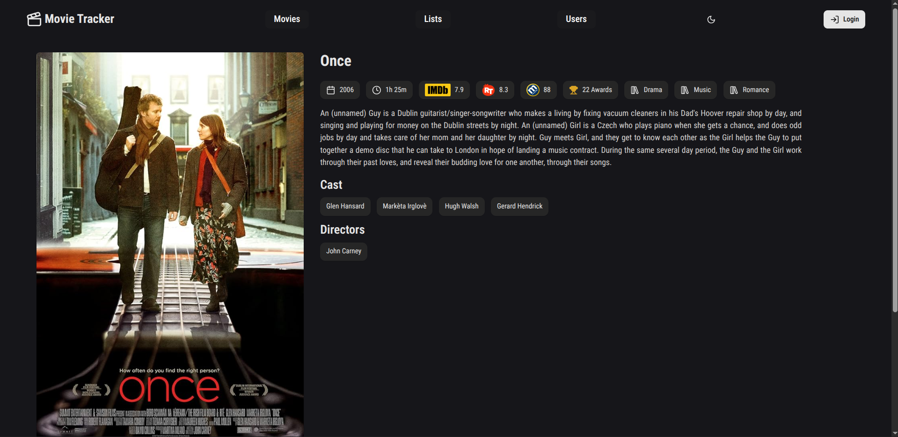
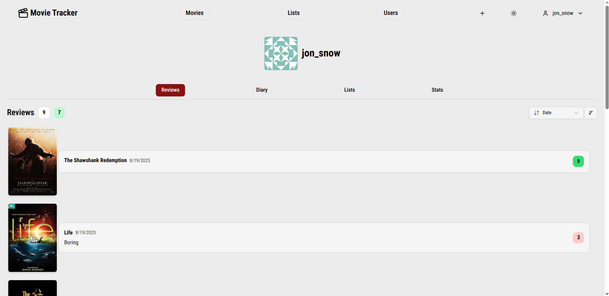
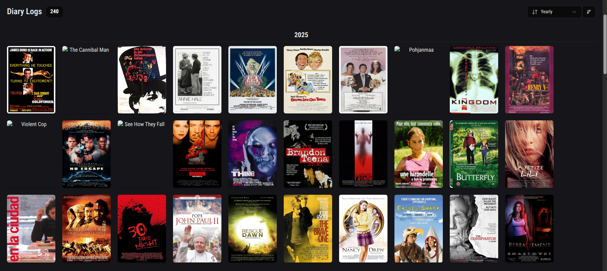
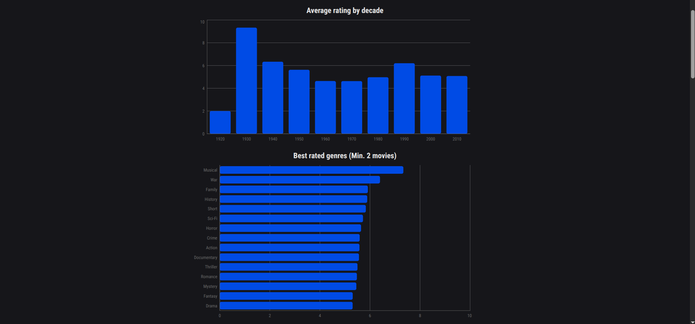
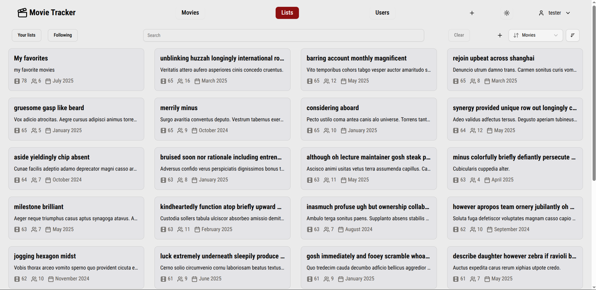
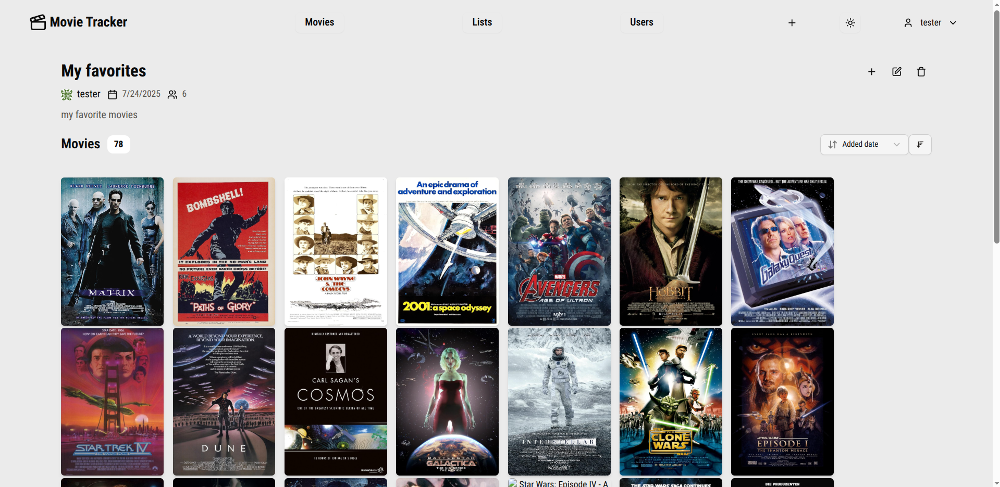
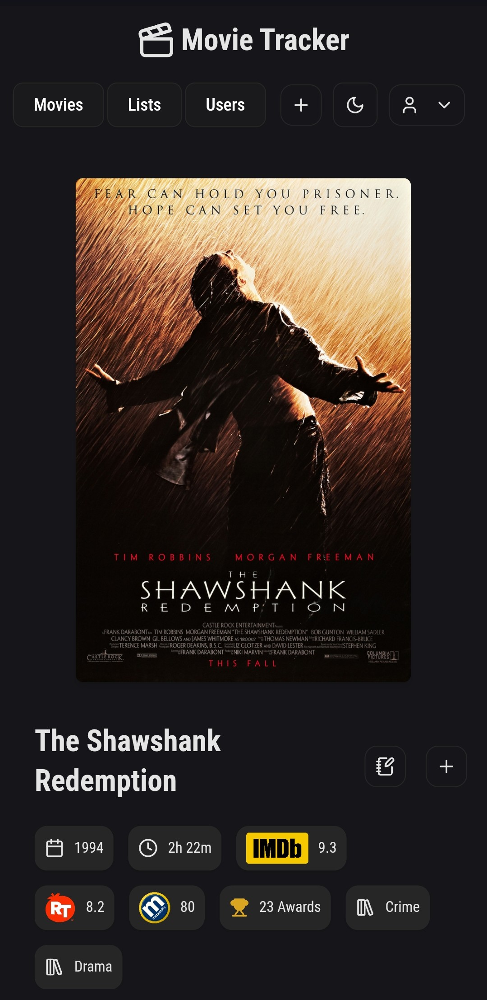
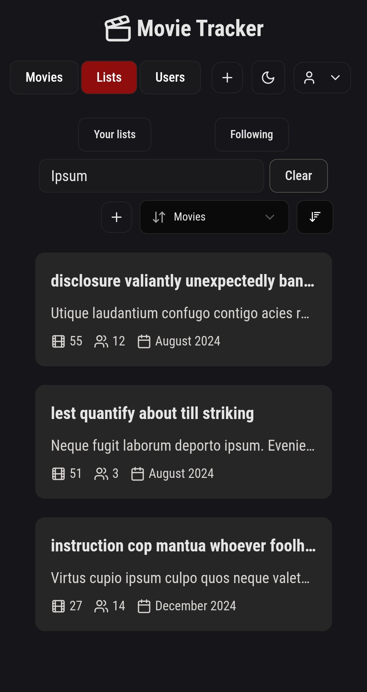
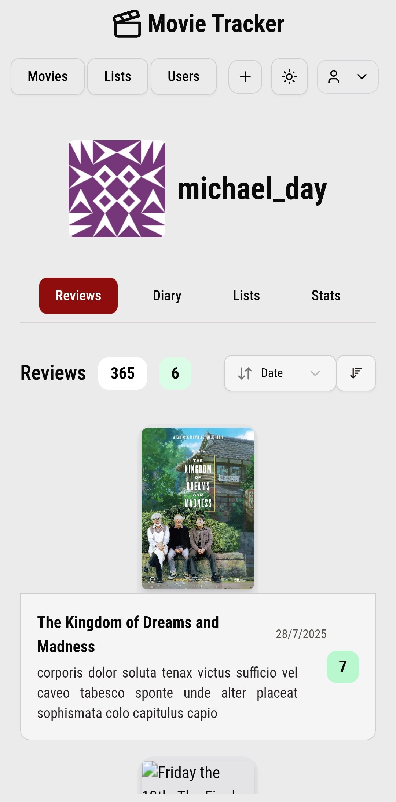

# Movie Tracker

A web app for searching, tracking and rating movies (and some TV shows)

## Live demo

[Check out the live demo](https://movietracker-flax.vercel.app/)

## Features

- **Search and filters**: You can filter movies by release year, rating, genre, language, cast or directors
- **Diary logs**: Track the movies you've watch
- **Reviews**: Rate movies on a 10-point scale with optional written reviews
- **Lists**: Create public or private collections
- **Social features**: Follow other users lists
- **Stats**: View your activity with charts like average rating by decade, genre and director, movies watched by year or your most watched genres, actors and directors

## Build with

- **Framework**: Next.js
- **Styling**: Tailwind and Shadcn
- **Auth**: Better Auth
- **Database**: MongoDB
- **Testing**: Vitest, Playwright
- **Hosting**: Vercel
- **Libraries**: Axios, React Query, date-fns, Lucide, Zod

## Time tracking

The time tracking document is available [here](/timeTracking.md)

## Tests

The project has end to end tests that run on playwright and unit test running on vitest. Both of them use a test database that has the same indexes as the production database but with less data. A playwright report is available on https://felixbruguera.github.io/movietracker/

## Notes

The dataset has movies up to 2016 and there are a lot of broken images. Most of the lists, reviews and users were seeded with placeholder data

## Screenshots

